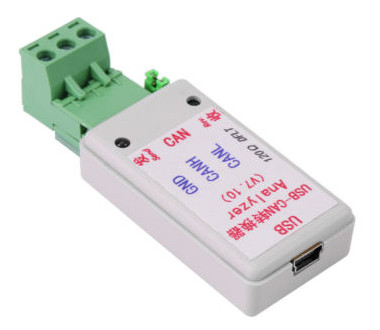

# USB-CAN Analyzer Linux Support

This is a small C program that dumps the CAN traffic for one these adapters:


These adapters can be found everywhere on Ebay nowadays, but there is no official Linux support. Only a Windows binary file [stored directly on GitHub](https://github.com/SeeedDocument/USB-CAN_Analyzer).

When plugged in, it will show something like this:
```
Bus 002 Device 006: ID 1a86:7523 QinHeng Electronics HL-340 USB-Serial adapter
```
And the whole thing is actually a USB to serial converter, for which Linux will provide the 'ch341-uart' driver and create a new /dev/ttyUSB device. So this program simply implements part of that serial protocol.

